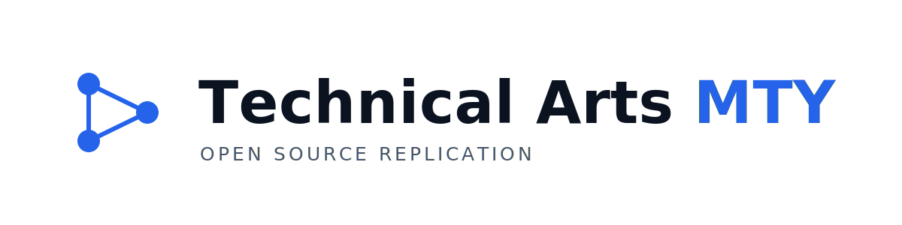

<div align="center">

<picture>
  <source media="(prefers-color-scheme: dark)" srcset="assets/ta1.svg">
  
</picture>

<br>

**Open source replication of real-world systems**

As the first Student Chapter of the digital twins field, Technical Arts is
dedicated to the modeling of dynamic systems in order to replicate their
behavior to predict failures, make corrections in real time, and obtain
actionable results from the sensing of their parameters.

<br>

[About](#about)&nbsp;&nbsp;·&nbsp;&nbsp;[Research &amp; Engineering](#research--engineering-areas)&nbsp;&nbsp;·&nbsp;&nbsp;[Projects](#open-projects)&nbsp;&nbsp;·&nbsp;&nbsp;[Communities](#communities)&nbsp;&nbsp;·&nbsp;&nbsp;[Contribute](#how-to-contribute)&nbsp;&nbsp;·&nbsp;&nbsp;[Contact](#contact)

<br>

[](#license)
&nbsp;[](https://github.com/Technical-Arts-MTY/.github/blob/main/CODE_OF_CONDUCT.md)
&nbsp;[](https://github.com/orgs/Technical-Arts-MTY/discussions)

</div>

---

## About

**What we are.**
We are a community of students and reasearchers with the hiperfixation of replying dynamic systems 
starting from its behaviour, modelling it mathematically, testing it physically and bringing its body to te 
real world trough engineering, giving it brain with IA. Our systems have the objetive of making a real-world 
phenomena ideal, predicting failures before they happen and getting actionable results by sensing electronically systems.
For pur open-source phylosophy, anyone can contribute, build and study our **Digital Twins**.


**Philosophy.**

- **Body-Centered Develop.** Every technical/math intensive documentation should have a clear explanation. Is suggested the [4D methodology](https://www.youtube.com/watch?v=iXTr-tumegM&t=52s). for explaining DT.
- **Researcher mind is a must.** All DT repositories have a "resources" branch, with free-access books and material to understand well the principles of the model.
- **Real Brains are strongly valued.** As the use of IA is no forbidden, it must be documented when some code block is written by it. Understanding a subject using IA is OK.
- **Reproducibility first.** Results should be re-runnable; measurements state units, uncertainty, and method.
- **Engineering rigor.** Clean interfaces, tested code, and maintainable systems over one-off demos.
- **Mentorship and continuity.** We grow maintainers and hand projects forward, not abandon them.

**Objectives.**

- Build digital replicas of relevant real-world problem solving systems.
- Publish reproducible research artifacts is a must.
- Bridge academia and industry through applied, high-impact projects.
- Cultivate a durable community of contributors and maintainers.

---

## Research &amp; Engineering Areas

| Area | Focus |
|---|---|
| **Artificial Intelligence** | Applied machine learning, model training and evaluation, on-device inference. |
| **Data Science** | Instrumentation pipelines, analysis, and reproducible experiment workflows. |
| **Embedded Systems** | Microcontroller and edge firmware, real-time acquisition, sensor integration. |
| **Robotics** | Control, perception, and autonomy for physical systems. |
| **Computer Vision** | Imaging, measurement, calibration, and scene understanding. |
| **Infrastructure** | Reproducible environments, CI/CD, and tooling for research and development. |
| **Hardware** | PCB design, prototyping, and instrumentation for the physical world. |
| **Graphics Software Engineering** | Interactive 3D enviroments build with OpenGL/OpenUSD/Unity. |
| **Open Source** | Libraries, tools, and documentation released and maintained for the community. |


Each area has an open **Lead** position, currently recruiting. Additional
coordination roles may be proposed once a Lead is in place.

---

## Open Projects

### Native work lines

Projects that originate and are developed within the collective.

| Project | Description | |
|---|---|---|
| **Michelson Interferometer Digital Twin** | A real-time digital twin of an optical interferometer, pairing a physics simulation with embedded acquisition for teaching and metrology. | [Repository →](https://github.com/Aaron-Cuevas/Michelson_Interferometer_Digital_Twin) |
| **Ground Twin** | A portable ecological instrument: a field digital twin of terrain that couples a RothC soil-carbon model with on-device inference on edge hardware. | [Repository →](#) |

### Affiliated work line

**DT-HRES** is a separate, open-source work line coordinated by **Dr. Rasikh
Tariq**. It is open to new contributors.

[Repository →](https://github.com/Aaron-Cuevas/DT-HRES-S)

---

## Communities

We coordinate in two WhatsApp communities (Spanish language)

### Vinculation

For the chapter's members and experienced collaborators. It shares
progress on projects and events of relevance, and gives access to the main
projects and their contributors — a pool of talent specialized in Digital Twins
and its interdisciplinary nature (programming, electronics, mechanics, and
artificial intelligence). Members may share events, certifications, and
hackathons that support joint development and learning in Digital Twins.

[**Join the Vinculation community →**](https://chat.whatsapp.com/H6sGz6mqA5gCXDvuw3RXfs?s=sw&p=i&mlu=2)

### Open Source

For contributors building their portfolio through active training and the
construction of dynamic-systems replication projects — industrial, natural, and
scientific. Access the projects and contribution guides through the shared notes
repository, from your terminal:

```
gh repo clone Technical-Arts-MTY/notas     # clone (first time only)
cd notas
python notes.py
```

[**Join the Open Source community →**](https://chat.whatsapp.com/EiydHW1rvXtCdQaw9RsNTF?s=sw&p=i&mlu=2)

---

## How to Contribute

Contributions are welcome, from first-time contributors to experienced
maintainers.

1. **Start here.** Read the [Contributing Guide](https://github.com/Technical-Arts-MTY/.github/blob/main/CONTRIBUTING.md) and the
   [Code of Conduct](https://github.com/Technical-Arts-MTY/.github/blob/main/CODE_OF_CONDUCT.md).
2. **Find an issue.** Look for [`good first issue`](https://github.com/orgs/Technical-Arts-MTY/repositories)
   labels in the repositories, or open one to propose your idea.
3. **Set up.** Follow the development instructions in the project's `README`.
4. **Submit a pull request.** Keep changes focused, describe what and why, and
   link the related issue.
5. **Review and merge.** A maintainer will review; discussion happens on the PR.

New contributors are welcome to join the **Open Source** community above and the
biweekly development meeting.

---

## Partners

We collaborate with academic groups, industry teams, and the alumni network to
turn open engineering into real-world impact.

- **Academia** — research groups and faculty at Tecnológico de Monterrey and beyond.
- **Industry** — companies applying and supporting open technology.
- **Exatec** — the Tecnológico de Monterrey alumni network.

Interested in partnering or sponsoring a project? [Get in touch](#contact).

---

## Maintainers

The core team stewarding the collective and its projects.

| Name | Role | GitHub |
|---|---|---|
| Aaron | President · Engineering | [@Aaron-Cuevas](https://github.com/Aaron-Cuevas) |
| Alfred | Social Responsibility | [@AlfredoLuce](https://github.com/AlfredoLuce)|
| Joel | Treasury | `@—` |
| German | Marketing | [@GermanGit-Creator](https://github.com/GermanGit-Creator) |
| Edgar | Math Lead | [@EdgarIFI](https://github.com/EdgarIFI) |

> Vice President and Project Management roles are currently open.

---

## Contact

- **GitHub Discussions** — [github.com/orgs/Technical-Arts-MTY/discussions](https://github.com/orgs/Technical-Arts-MTY/discussions)
- **Email** — `contact@technicalartsmty.org` >
- **Communities** — see [Communities](#communities) above
- **Location** — Monterrey, Nuevo León, México

---

## License

Unless otherwise stated, projects in this organization are released under the
**MIT License**. Each repository specifies its own license; refer to the
`LICENSE` file within a project for its exact terms.

<div align="center"><sub>© Technical Arts MTY · Built in the open at Tecnológico de Monterrey.</sub></div>
